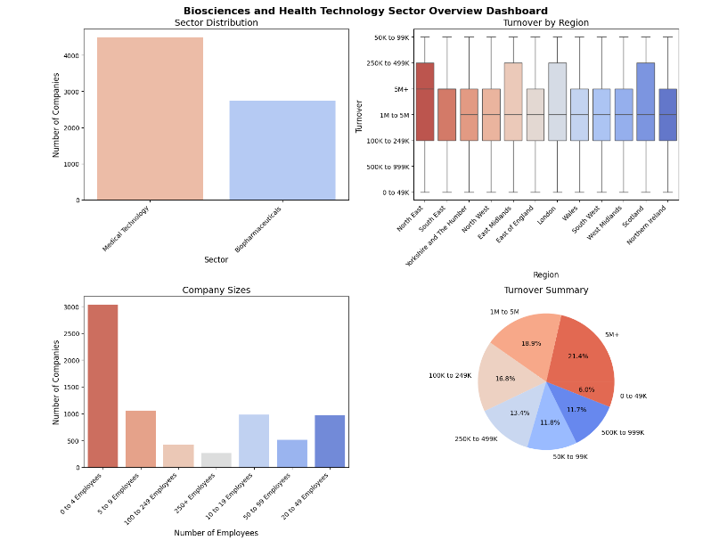
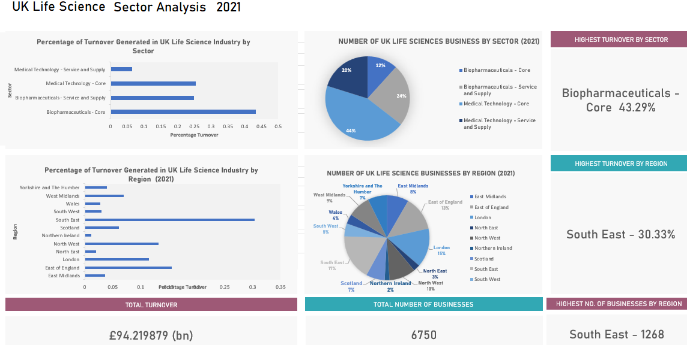

# Life Science Industry Analysis Dashboards 

## Description

Utilizing Python and Excel for data processing, visualization and dashboard creation, this project analyzes government statistics data pertaining to the life science industry. Through data cleaning and analysis, it identifies trends and patterns, particularly focusing on turnover by sector and region.
The project's main objective is to present these insights in an accessible manner through Python and Excel dashboards. By highlighting the highest turnover sectors and regions, stakeholders gain valuable insights for strategic planning and resource allocation.

## Importance and Functionality

The purpose of this project is to leverage government statistics data to provide valuable insights into the life science industry through data cleaning, analysis, and visualization techniques. By utilizing Python for data processing and visualization and Excel for dashboard creation, this project aims to offer actionable information to stakeholders in the life science sector, facilitating informed decision-making and strategic planning.

## Table of Contents

- [Python Data Analysis and Dashboard](#Python Analysis)
- [Usage](#usage)
- [Screenshots](#screenshots)
- [Credits](#credits)

## Python Analysis 
[Notebook](https://github.com/haneenkheir/Life_science_industry_analysis-/blob/main/Biosci_sector_dashboard.ipynb)

## Excel Analysis 
[Workbook]([https://github.com/haneenkheir/Life_science_industry_analysis-/blob/main/Biosci_sector_dashboard.ipynb](https://github.com/haneenkheir/Life_science_industry_analysis-/blob/main/Life_science_industry_analysis_dashboard.xlsx))

## Credits

This project was created by [Haneen Kheir ](https://github.com/haneenkheir). [Data Source](https://www.gov.uk/government/statistics/bioscience-and-health-technology-sector-statistics-2021)  

